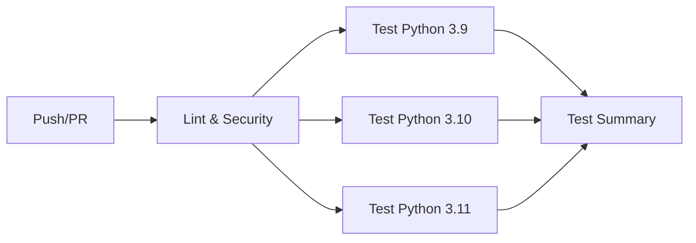

# CI/CD セットアップガイド

## 概要

このプロジェクトは、GitHub Actionsを使用した完全なCI/CDパイプラインを備えています。

## 🚀 自動実行されるチェック

コードを`main`または`develop`ブランチにプッシュ、またはPRを作成すると、以下が自動実行されます:

### 1. Lint & Security (Job 1)
- **flake8**: コードスタイルチェック
- **mypy**: 型チェック（警告のみ）
- **bandit**: セキュリティ脆弱性スキャン

### 2. Tests (Job 2)
- **複数Pythonバージョン**: 3.9, 3.10, 3.11 でテスト実行
- **カバレッジ計測**: コードカバレッジレポート生成
- **テスト結果保存**: 失敗時の詳細レポート保存

### 3. Test Summary (Job 3)
- 全テスト結果のサマリー表示
- GitHub ActionsのSummaryページに結果表示

## 📋 CI/CDパイプライン構成



## 🛠️ ローカルでの実行

### 初回セットアップ

```bash
# 1. 開発用依存関係のインストール
pip install -r requirements-dev.txt

# 2. Pre-commitフックのインストール
python -m pre_commit install
```

### 各種チェックの手動実行

```bash
# 全チェックを実行
make all

# 個別実行
make test      # テスト実行
make lint      # Lintチェック
make format    # コード整形
make security  # セキュリティチェック
```

### Pre-commit フックの使用

Pre-commitフックをインストールすると、コミット前に自動でチェックが実行されます:

```bash
# インストール
python -m pre_commit install

# 手動で全ファイルに実行
python -m pre_commit run --all-files

# 特定のフックのみ実行
python -m pre_commit run black --all-files
```

実行されるチェック:
- ✅ コード整形 (black, isort)
- ✅ Lintチェック (flake8)
- ✅ セキュリティチェック (bandit)
- ✅ YAML/JSON検証
- ✅ ファイル末尾の改行チェック
- ✅ 大きなファイルの検出
- ✅ マージコンフリクトの検出
- ✅ 秘密鍵の検出

## 📊 カバレッジレポートの確認

### GitHub Actions上で確認

1. Actions タブを開く
2. 実行されたワークフローをクリック
3. Artifacts セクションから `coverage-report-py3.10` をダウンロード
4. `htmlcov/index.html` をブラウザで開く

### ローカルで確認

```bash
# テスト実行 + カバレッジ生成
make test

# ブラウザでレポートを開く (Mac)
open htmlcov/index.html

# ブラウザでレポートを開く (Linux)
xdg-open htmlcov/index.html
```

## 🔐 セキュリティチェック

### Bandit (静的セキュリティスキャン)

```bash
# ローカル実行
make security

# 詳細レポート生成
python -m bandit -r src/ -ll -f html -o bandit-report.html
open bandit-report.html
```

GitHub Actions上では、セキュリティレポートがアーティファクトとして保存されます。

## ⚙️ CI設定のカスタマイズ

### テストするPythonバージョンの変更

[.github/workflows/ci.yml](.github/workflows/ci.yml) の `matrix.python-version` を編集:

```yaml
strategy:
  matrix:
    python-version: ["3.9", "3.10", "3.11", "3.12"]
```

### カバレッジ閾値の変更

[pytest.ini](pytest.ini) の `--cov-fail-under` を編集:

```ini
--cov-fail-under=30  # 30%以上を要求
```

### Pre-commitでテストを自動実行

[.pre-commit-config.yaml](.pre-commit-config.yaml) の最後の部分をアンコメント:

```yaml
- repo: local
  hooks:
    - id: pytest
      name: pytest
      entry: python -m pytest tests/ -v
      language: system
      pass_filenames: false
      always_run: true
```

⚠️ **注意**: コミットごとに全テストが実行されるため、時間がかかる可能性があります。

## 🎯 ベストプラクティス

### コミット前のチェックリスト

1. ✅ ローカルでテストが通る: `make test`
2. ✅ Lintエラーがない: `make lint`
3. ✅ コードが整形されている: `make format`
4. ✅ セキュリティ警告がない: `make security`

### PR作成時のチェックリスト

1. ✅ PRのタイトルが明確
2. ✅ 変更内容の説明がある
3. ✅ 新機能には対応するテストを追加
4. ✅ ドキュメント（必要に応じて）を更新
5. ✅ CI/CDが全てパス

### テスト追加のルール

新しいコードを書いたら、必ず対応するテストを追加:

```python
# 新機能を追加
def new_feature(x):
    return x * 2

# 対応するテストを追加 (tests/test_module.py)
def test_new_feature():
    assert new_feature(5) == 10
```

## 🐛 トラブルシューティング

### CI が失敗する

1. **Lintエラー**:
   ```bash
   make lint  # ローカルで確認
   make format  # 自動修正
   ```

2. **テスト失敗**:
   ```bash
   make test  # ローカルで再現
   pytest tests/test_file.py::test_name -v  # 特定のテスト実行
   ```

3. **カバレッジ不足**:
   ```bash
   make test  # htmlcovでカバレッジを確認
   open htmlcov/index.html
   ```

### Pre-commit が遅い

```bash
# キャッシュをクリア
python -m pre_commit clean

# 再インストール
python -m pre_commit install --install-hooks
```

### 特定のチェックをスキップ

```bash
# 一時的にpre-commitをスキップ
git commit --no-verify -m "message"

# 特定のファイルを除外 (.pre-commit-config.yaml)
exclude: ^(migrations/|docs/)
```

## 📈 カバレッジ目標

- **短期目標**: 30% (現在達成)
- **中期目標**: 60%
- **長期目標**: 80%+

優先度:
1. `src/database.py` - 38% → 80%
2. `src/jira_client.py` - 0% → 60%
3. `src/analyzer.py` - 0% → 40%
4. `src/app.py` - 0% → 20% (UI部分は統合テストで)

## 🔄 継続的改善

### 週次レビュー

1. カバレッジレポート確認
2. Banditレポート確認
3. テスト失敗履歴確認
4. パフォーマンスボトルネック確認

### 月次タスク

1. 依存関係の更新
2. セキュリティアドバイザリ確認
3. CI/CD パイプラインの最適化
4. テストケースのリファクタリング

## 📚 参考資料

- [GitHub Actions Documentation](https://docs.github.com/en/actions)
- [pytest Documentation](https://docs.pytest.org/)
- [pre-commit Documentation](https://pre-commit.com/)
- [flake8 Documentation](https://flake8.pycqa.org/)
- [bandit Documentation](https://bandit.readthedocs.io/)

## 🚨 緊急時の対応

### CIをバイパスして緊急デプロイ

⚠️ **推奨されません** - 本番環境の問題修正など、緊急時のみ使用:

```bash
# PRマージ時にCIをスキップ (mainブランチへの直接プッシュ)
git push origin main --no-verify
```

必ず事後に:
1. イシューを作成
2. テストを追加
3. CI/CDを通してPRを作成
4. レビュー実施
